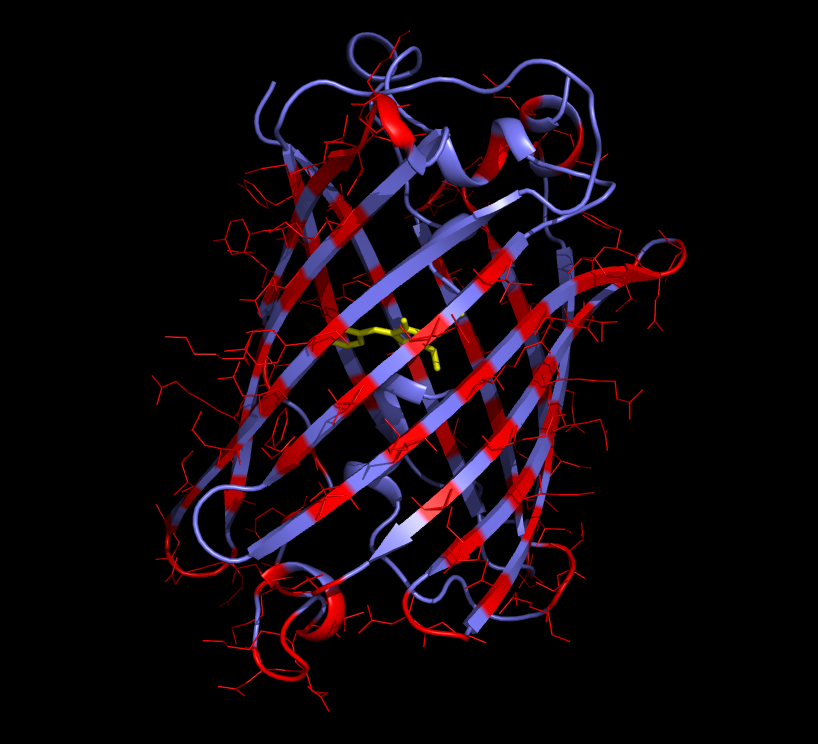

# 1yfpA
Files for glycosylation of YFP

  

We are not the first to try designing glycosylation sites into a GFP based molecule. In "Expression of a glycosylated GFP as a bivalent reporter in expcytosis" (DOI:10.1007/s00299-009-0799-7), three N-linked glycosylation sites were engineered into a GFP based molecule. These sites were residues 80, 133, and 172. Residue 80 did not fold. Residue 133 folded and was glycosylated. Residue 172 was mutated with some additional inserted residues. It folded but was not glycosylated. This paper was nice in that it clearly illustrated each of the possible outcomes of engineering glycosylation sites into an existing protein.

We note that the recent version of gly20 does not suggest residue 80 as a potential glycosylation site. This was the site that did not fold. However gly20 does suggest residues 133 and 172 as potential glycosylation sites. Although residue 172 was not engineered as point mutations, we note that mutations in the vicinity of 172 did not result in a misfolded protein, and residue 133 not only folded but was glycosylated as well.

Here are the steps for running gly20 on 1yfp.pdb along with the predictions for potential glycosylation sites. We note that at least one prediction will likely not function correctly as the sidechain is pointing inward toward YFP's solvent pocket. This is residue 203. A more sophisticated solvent accessibility algorithm or some other method of telling the difference between the inside and the outside of the protein might be desireable.

1yfp steps (using pymol)
------------------------

download 1yfp.pdb from rcsb.org

load 1yfp.pdb in pymol

select ca, chain A

save as 1yfpA.pdb

load 1yfpA.pdb in pymol

type findSurfaceResidues

save atoms as 1yfpA_exposed_atm.pdb

save residues as 1yfpA_exposed_res.pdb

select helix, ss H

save as 1yfpA_helix.pdb

select sheet, ss S

save as 1yfpA_sheet.pdb

run gly20.py

fix up incomplete sidechains as needed using mutate wizard and repeat above

output from running gly20.py
----------------------------

Chain A sequence has 229 residues:

ZZKGEELFTGVVPILVELDGDVNGHKFSVSGEGEGDATYGKLTLKFICTTGKLPVPWPTLVTTFZZZLQCFARYPDHMKRHDFFKSAMPEGYVQERTIFFKDDGNYKTRAEVKFEGDTLVNRIELKGIDFKEDGNILGHKLEYNYNSHNVYIMADKQKNGIKVNFKIRHNIEDGSVQLADHYQQNTPIGDGPVLLPDNHYLSYQSALSKDPNEKRDHMVLLEFVTAAGI

Chain A has 140 solvent accessible residues:

3+5+6+7+9+10+11+13+15+17+19+21+23+24+25+26+28+30+32+33+34+36+37+38+39+41+43+45+47+49+50+51+52+54+56+62+73+75+76+77+79+80+85+86+87+89+90+93+95+97+99+101+102+105+107+109+110+111+113+114+115+116+117+118+120+122+124+126+128+129+131+132+133+134+135+137+138+139+140+142+143+144+146+147+148+149+151+153+154+155+156+157+158+159+162+164+166+168+170+172+173+174+175+176+178+180+182+184+186+188+189+190+191+192+194+195+197+198+200+202+203+204+205+206+208+209+210+211+212+213+214+215+216+219+221+222+223+225+227+228

Chain A has 105 solvent accessible pairs:

3+5+7+9+11+13+15+17+19+21+23+24+26+28+30+32+34+36+37+39+41+43+45+47+49+50+52+54+73+75+77+85+87+93+95+97+99+105+107+109+111+113+114+115+116+118+120+122+124+126+129+131+132+133+135+137+138+140+142+144+146+147+149+151+153+154+155+156+157+162+164+166+168+170+172+173+174+176+178+180+182+184+186+188+189+190+192+195+198+200+202+203+204+206+208+209+210+211+212+213+214+219+221+223+225

Chain A has 121 beta sheet residues:

12+13+14+15+16+17+18+19+20+21+22+25+26+27+28+29+30+31+32+33+34+35+36+40+41+42+43+44+45+46+47+48+92+93+94+95+96+97+98+99+100+103+104+105+106+107+108+109+110+111+112+113+114+115+118+119+120+121+122+123+124+125+126+127+128+148+149+150+151+152+153+154+155+159+160+161+162+163+164+165+166+167+168+169+170+171+174+175+176+177+178+179+180+181+182+183+184+185+186+187+199+200+201+202+203+204+205+206+207+208+217+218+219+220+221+222+223+224+225+226+227

Chain A has 31 alpha helix residues:

4+5+6+7+8+57+58+59+60+61+62+63+69+70+71+76+77+78+79+83+84+85+86+87+135+136+137+138+156+157+158

Chain A has 72 random coil residues:

3+9+10+11+23+24+37+38+39+49+50+51+52+53+54+55+56+64+68+72+73+74+75+80+81+82+88+89+90+91+101+102+116+117+129+130+131+132+133+134+139+140+141+142+143+144+145+146+147+172+173+188+189+190+191+192+193+194+195+196+197+198+209+210+211+212+213+214+215+216+228+229

Chain A has 53 potential beta sheet glycosylation sites:
(site sequence)

(17 ELD)
(19 DGD)
(21 DVN)
(26 KFS)
(28 SVS)
(30 SGE)
(32 EGE)
(34 EGD)
(36 DAT)
(41 KLT)
(43 TLK)
(45 KFI)
(47 ICT)
(93 VQE)
(95 ERT)
(97 TIF)
(99 FFK)
(105 NYK)
(107 KTR)
(109 RAE)
(111 EVK)
(113 KFE)
(114 FEG)
(115 EGD)
(118 TLV)
(120 VNR)
(122 RIE)
(124 ELK)
(126 KGI)
(149 NVY)
(151 YIM)
(153 MAD)
(154 ADK)
(155 DKQ)
(162 KVN)
(164 NFK)
(166 KIR)
(168 RHN)
(170 NIE)
(174 GSV)
(176 VQL)
(178 LAD)
(180 DHY)
(182 YQQ)
(200 YLS)
(202 SYQ)
(203 YQS)
(204 QSA)
(206 ALS)
(219 VLL)
(221 LEF)
(223 FVT)
(225 TAA)

17+19+21+26+28+30+32+34+36+41+43+45+47+93+95+97+99+105+107+109+111+113+114+115+118+120+122+124+126+149+151+153+154+155+162+164+166+168+170+174+176+178+180+182+200+202+203+204+206+219+221+223+225

Chain A has 8 potential alpha helix glycosylation sites:
(site sequence)

(5 EEL)
(7 LFT)
(85 KSA)
(135 NIL)
(137 LGH)
(138 GHK)
(156 KQK)
(157 QKN)

5+7+85+135+137+138+156+157

Chain A has 20 potential random coil glycosylation sites:
(site sequence)

(9 TGV)
(23 NGH)
(24 GHK)
(37 ATY)
(39 YGK)
(49 TTG)
(50 TGK)
(116 GDT)
(129 DFK)
(131 KED)
(132 EDG)
(133 DGN)
(140 KLE)
(142 EYN)
(144 NYN)
(146 NSH)
(147 SHN)
(172 EDG)
(173 DGS)
(214 KRD)

9+23+24+37+39+49+50+116+129+131+132+133+140+142+144+146+147+172+173+214

There are 53 common potential beta sheet glycosylation sites:

17+19+21+26+28+30+32+34+36+41+43+45+47+93+95+97+99+105+107+109+111+113+114+115+118+120+122+124+126+149+151+153+154+155+162+164+166+168+170+174+176+178+180+182+200+202+203+204+206+219+221+223+225

There are 8 common potential alpha helix glycosylation sites:

5+7+85+135+137+138+156+157

There are 20 common potential random coil glycosylation sites:

9+23+24+37+39+49+50+116+129+131+132+133+140+142+144+146+147+172+173+214

There are 81 common potential glycosylation sites:

5+7+9+17+19+21+23+24+26+28+30+32+34+36+37+39+41+43+45+47+49+50+85+93+95+97+99+105+107+109+111+113+114+115+116+118+120+122+124+126+129+131+132+133+135+137+138+140+142+144+146+147+149+151+153+154+155+156+157+162+164+166+168+170+172+173+174+176+178+180+182+200+202+203+204+206+214+219+221+223+225

------------------
(program exited with code: 0)
Press return to continue
